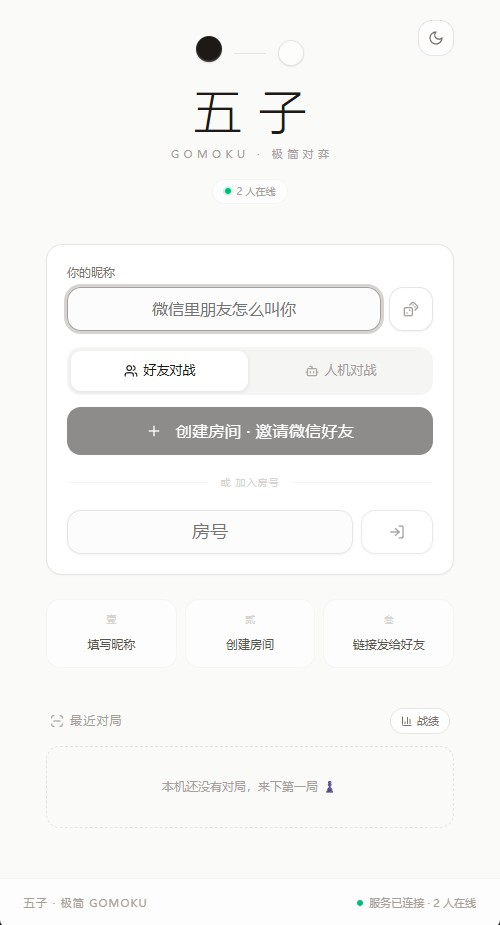

<div align="center">

# 五子 · 联机五子棋


<br/>


<br/>


[](https://5zi.vercel.app)

<br/>



<sub>大厅首页 —— 填昵称 → 建房 → 邀请，三步开局</sub>

<br/>

[在线试玩](https://5zi.vercel.app) · [快速开始](#快速开始) · [AI 对手设置](#ai-对手设置自定义-大模型) · [架构](#架构) · [部署](#部署) · [REST API](#rest-api) · [测试脚本](#测试脚本)

</div>

---

极简画风的联机五子棋 Web 应用：填个昵称，创建房间，通过链接 / 二维码 / 邀请文案把好友拉进来对弈。内置 AI 引擎「弈心」，也支持**接入任意 OpenAI 兼容大模型作为 AI 对手**（DeepSeek / OpenAI / 智谱 / Kimi / 通义 / Ollama 本地模型等）。服务端权威判定、段位战绩、复盘回放一应俱全——**无需部署，[在线试玩](https://5zi.vercel.app)打开即玩**；也可开箱部署到 Vercel 自建。

## 目录

- [在线试玩](#在线试玩)
- [功能特性](#功能特性)
- [技术栈](#技术栈)
- [架构](#架构)
- [快速开始](#快速开始)
- [AI 对手设置（自定义大模型）](#ai-对手设置自定义-大模型)
- [部署](#部署)
- [环境变量](#环境变量)
- [项目结构](#项目结构)
- [REST API](#rest-api)
- [测试脚本](#测试脚本)
- [参与贡献](#参与贡献)
- [版权与许可](#版权与许可)

## 在线试玩

**👉 [https://5zi.vercel.app](https://5zi.vercel.app)** —— 免注册，手机 / 电脑均可直接开局（公开站点托管于 Vercel）。

- **好友对弈**：建房后把链接 / 二维码 / 邀请文案发给好友，打开即入房，支持观战与房间聊天
- **人机对战**：挑战内置「弈心」三档难度，或在「AI 对手设置」中接入 DeepSeek / OpenAI 等大模型执子对弈
- **战绩档案**：段位徽章、胜率趋势、落子热力图与逐手复盘回放

## 功能特性

### 好友对弈（PVP）

- **一键邀请**：建房后通过链接、二维码、邀请文案（Web Share）分享，好友打开自动入房
- **服务端权威判定**：15×15 标准棋盘，五连检测、满盘和棋全部由服务端裁定，前端仅作展示
- **对局规则**：每步 60s 限时（超时判负）、悔棋（请求—同意/拒绝）、认输、换边再战、房间比分
- **断线保护**：心跳判活 + 60s 重连窗口（超时判负）、等待态 30s 座位保留、空房间 10 分钟自动回收
- **房间互动**：房间内聊天（快捷短语 + 未读角标）、表情弹幕/表情雨、观战模式、AI 座位接管（好友点链接可接管 AI 座位变真人对战）

### 人机对战（Solo）

- 内置 AI 引擎「弈心」，**入门 / 进阶 / 大师** 三档难度（棋型评分 + α-β 搜索 + VCT 算杀）
- **自定义 AI 对手**：在「AI 对手设置」中接入任意 OpenAI 兼容大模型，让 LLM 执子对弈（见下文）
- 连胜自动建议升级难度；每局每方 3 次**提示**（必胜 / 防守 / 最佳点）
- 自定义模型调用失败或超时（8s）自动回退内置引擎，人机对局永不中断

### 数据与成长

- **段位系统**：RP 积分段位徽章，大厅实时展示
- **战绩档案**：按本机（设备标识）聚合的对局列表、胜率趋势、对手交锋记录、落子热力图
- **复盘回放**：逐手回放 + 全局黑方胜率曲线（每手评估）
- **实时胜率条**：对局中 / 观战时展示局势评估曲线

### 体验细节

- **视觉语言**：宣纸 × 墨的纸墨世界——思源宋体（Noto Serif SC）展示字型、大厅「虚位棋盘」氛围层与每日棋谚、编排式入场动效；胜局以「钤印」仪式呈现（朱砂印环 + 宋体盖章 + 表情雨），棋子为蛤壳式立体渐变
- **横屏模式**：桌面原生全屏 + 屏幕方向锁；iOS Safari / 微信 WKWebView 下 CSS 伪横屏兜底
- 深浅色主题（浅色宣纸 / 深色墨盘双套材质）、WebAudio 合成音效（落子 / 胜负 / 提示）、键盘方向键 + 回车落子
- OG 分享卡片、PWA manifest、移动端深度适配、全局错误兜底页

## 技术栈

| 层 | 技术 |
| --- | --- |
| 前端 | Next.js 16（App Router）· React 19 · TypeScript 5 · Tailwind CSS 4 · shadcn/ui · framer-motion · qrcode.react · Noto Serif SC（展示宋体） |
| 实时对战 | Next.js API 路由 + 轮询（Serverless 友好，权威逻辑在 `src/server/gomoku`） |
| 数据持久化 | Netlify Blobs（Serverless 部署）· Prisma 6 + SQLite（本地/自托管） |
| 遗留自托管 | Node + Socket.IO 4（Bun 运行，`mini-services/gomoku-server`，需 Caddy 网关） |
| 工程 | TypeScript · ESLint · Bun（或 Node.js 20+） |

## 架构

```
【Netlify Serverless（默认，仓库已适配）】

  浏览器 ──▶ Netlify CDN + OpenNext 适配器
              ├─ 页面 / 静态资源（next build）
              ├─ /api/gomoku        房间动作 + 状态轮询（Serverless 函数）
              ├─ /api/matches|rank  战绩读写（Netlify Blobs 存储）
              └─ 房间状态：Blobs 强一致读写；AI 走子在函数内同步计算
                 （自定义 LLM 调用 8s 超时 → 自动回退内置启发式引擎）

【本地 / 自托管（遗留，仍可用）】

                 ┌──────────────────────────────┐
  浏览器 ───────▶│  Caddy 网关 :81               │
                 │  （仓库自带 Caddyfile）        │
                 └──────┬───────────────┬───────┘
              默认路由   │               │  ?XTransformPort=3003
                        ▼               ▼
             ┌────────────────┐   ┌─────────────────────┐
             │ Next.js :3000  │   │ Socket.IO 对战服务   │
             │ 页面 / REST API│   │ （已停止演进，仅供    │
             │ Prisma+SQLite  │   │   参考对照）          │
             └────────────────┘   └─────────────────────┘
```

- 对战权威逻辑移植为 `src/server/gomoku/engine.ts`（纯状态机，可序列化），由 `src/app/api/gomoku/route.ts` 暴露为轮询 API
- 前端 `src/lib/gomoku/useGomoku.ts` 已从 Socket.IO 重写为 HTTP 轮询（1.3s 房间轮询 + 4s 在线心跳），组件接口不变
- 并发模型：房间状态仅由「动作请求」写入；轮询只写独立的心跳记录，避免 Serverless 多实例覆盖棋局
- 每局结束由 `src/server/gomoku/runtime.ts` 直接落库（Blobs / Prisma 双后端）

## 快速开始

### 前置要求

- [Bun](https://bun.sh)（推荐）或 Node.js 20+

### 安装与运行（本地开发）

```bash
# 1. 克隆并安装依赖
git clone <repo-url> && cd <repo-name>
bun install

# 2. 配置环境变量
cp .env.example .env

# 3. 初始化数据库（生成 Prisma Client + SQLite 文件）
bun run db:generate
bun run db:push

# 4. 启动前端（端口 3000）
bun run dev
```

打开 http://localhost:3000 即可游玩（本地默认使用内存房间存储 + SQLite 战绩）。

## AI 对手设置（自定义大模型）

大厅选择「人机对战」→「AI 对手」卡片点**设置**，即可管理 AI 对手：

1. **内置「弈心」**：本地启发式引擎，无需任何配置，三档难度
2. **添加自定义 AI 模型**：任意 OpenAI 兼容 `/chat/completions` 接口
   - **显示名**：AI 座位昵称（如「DeepSeek 棋圣」）
   - **Base URL**：如 `https://api.deepseek.com/v1`（内置 DeepSeek / OpenAI / 智谱 / Kimi / 通义 / Ollama 预设一键填充）
   - **API Key**：仅保存在本机浏览器 localStorage，不对其他玩家泄露
   - **模型名 / 棋风设定 / 温度**：可选，支持自定义 AI 性格
   - **测试连接**：一键验证端点、密钥与模型可用性
3. 建人机房时把选中的配置随 `room:create` 提交，服务端在 AI 回合把棋盘渲染成文本提示词调用该模型落子；解析不合法自动纠错重试一次，失败/超时（8s）回退内置引擎

> 安全说明：API Key 存储于浏览器本地，仅随建房请求传到服务端内存/房间存储用于代为调用，不会回传给其他客户端。

## 部署

### 部署到 Vercel

本项目是标准 Next.js 应用，Vercel 原生支持、零配置即可部署（公开站点 [5zi.vercel.app](https://5zi.vercel.app) 即托管于 Vercel）：

1. 把仓库推送到 GitHub / GitLab / Bitbucket
2. 登录 [Vercel](https://vercel.com)，选择「Add New… → Project」导入该仓库
3. 保持默认构建配置，点击「Deploy」，稍候即可通过 `https://<项目名>.vercel.app` 访问

也可以在仓库根目录用 CLI 一键部署：

```bash
npm install -g vercel
vercel --prod
```

> 注意：Vercel 的 Serverless 函数没有持久文件系统，房间状态保存在函数内存中、战绩需要可写的 `DATABASE_URL` 且数据不保证持久。若需要完整的房间持久化与战绩档案体验，建议部署到 Netlify（见下）。

### 部署到 Netlify

仓库已内置 [netlify.toml](netlify.toml)（Next.js 官方运行时 + Netlify Blobs 存储），导入即用：

1. 把仓库推送到 GitHub / GitLab
2. 登录 [Netlify](https://app.netlify.com)，选择「Add new site → Import an existing project」导入该仓库
3. 构建命令与插件会自动读取 `netlify.toml`，无需额外环境变量，房间状态与战绩自动落到 Netlify Blobs

## 环境变量

| 变量 | 说明 | 示例 |
| --- | --- | --- |
| `DATABASE_URL` | Prisma SQLite 数据库文件路径（本地 / 自托管用） | `file:../db/custom.db` |

## 项目结构

```
├── netlify.toml                  # Netlify 部署配置（OpenNext 运行时）
├── Caddyfile                     # 遗留自托管网关配置（参考）
├── prisma/schema.prisma          # Match 对局模型（本地/自托管后端）
├── db/                           # SQLite 数据库文件（不入库）
├── mini-services/
│   └── gomoku-server/            # 遗留 Socket.IO 对战服务（参考对照）
├── src/
│   ├── server/
│   │   ├── gomoku/
│   │   │   ├── engine.ts         # 权威对局引擎（纯状态机，可序列化）
│   │   │   ├── llm.ts            # 自定义大模型落子（OpenAI 兼容 + 兜底）
│   │   │   ├── runtime.ts        # AI 调度 / 心跳合并 / 终局上报
│   │   │   └── store.ts          # 房间存储（内存 / Netlify Blobs 双后端）
│   │   └── match-store.ts        # 战绩存储（Prisma / Netlify Blobs 双后端）
│   ├── app/
│   │   ├── page.tsx              # 单路由入口（大厅）
│   │   ├── global-error.tsx      # 根级错误兜底（纸墨风错误页）
│   │   └── api/
│   │       ├── gomoku/           # 对战轮询 + 动作 API（建房/落子/悔棋/聊天/AI测试）
│   │       ├── matches/          # 对局落库、查询、交锋、热力图
│   │       ├── rank/             # 段位（RP）查询
│   │       └── og/               # OG 分享卡片图
│   ├── components/gomoku/        # 大厅/棋盘/对局室/AI设置/聊天/复盘/战绩等组件
│   └── lib/gomoku/               # 状态层：useGomoku（轮询）、AI 档案、音效、分享、段位
└── tests/                        # E2E / 回归 / AI 强度基准脚本（Node 直跑）
```

## REST API

| 方法 | 路径 | 说明 |
| --- | --- | --- |
| GET | `/api/gomoku?code=&pid=` | 房间状态轮询（兼心跳/回归） |
| GET | `/api/gomoku?mode=peek&code=` | 房间预览（大厅资料卡） |
| GET | `/api/gomoku?mode=presence` | 全服在线人数 |
| POST | `/api/gomoku` | 对战动作：`room:create`（含自定义 aiConfig）`room:join` `room:leave` `room:difficulty` `game:move` `game:undo-*` `game:rematch` `game:resign` `game:hint` `chat:send` `game:react` `ai:test` |
| POST | `/api/matches` | 对局结束落库 |
| GET | `/api/matches?pid=&all=1` | 最近对局 + 汇总统计（默认本机维度） |
| GET | `/api/matches/[id]` | 对局详情（含棋谱、每手评估） |
| GET | `/api/matches/head2head?aPid=&bPid=` | 两机交锋记录 |
| GET | `/api/matches/heatmap?pid=` | 落子热力图 |
| GET | `/api/rank?pids=` | 段位（RP）查询 |
| GET | `/api/og` | 动态 OG 分享卡片 |

## 测试脚本

`tests/` 下提供基于 Node 的回归与基准脚本（部分脚本基于旧 Socket.IO 协议，仅供参考）：

- `engine-bench.mjs` / `ai-hard-check.mjs` / `streak-difficulty-check.mjs` — AI 引擎强度与连胜难度基准
- `eval-check.mjs` / `hint-check.mjs` / `rank-check.mjs` — 评估曲线 / 提示 / 段位校验
- `reaction-presence-check.mjs` / `r7-spectate-rain.mjs` — 表情弹幕 / 观战与在线心跳回归（现行轮询协议）
- `pvp-regress.mjs` — PVP 房间流程回归（旧协议）
- `gomoku-bot.mjs` / `line-bot.mjs` — 自动对弈机器人（旧协议）

## 参与贡献

欢迎提交 Issue 与 PR：Bug 反馈、AI 引擎改进、移动端体验优化、测试脚本补充都很受欢迎。提交 PR 前请确保：

```bash
bun run lint
bun run build
```

均通过，并保持与现有代码一致的极简风格。

## 版权与许可

Copyright © 2026 FANG050829

本项目基于 [MIT License](LICENSE) 开源发布：任何人可自由使用、复制、修改与分发本项目，唯须在副本中保留上述版权声明与许可文本。完整条款见 [LICENSE](LICENSE) 文件。
